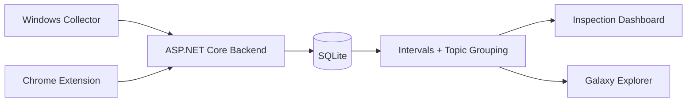

# Flightlog

**A universe made from where your attention has gone.**

Every day I search things, explore ideas, work on projects, plan trips, discover music, and fall into rabbit holes. Most of that trail eventually disappears.

Flightlog makes it visible.

Instead of browser history or screen-time charts, it turns digital activity into a living universe of interests. Spend weeks exploring robotics and **Robotics** grows into a world. Dive inside and find **Buddy → Control Systems → PID**. Old interests fade; new obsessions appear; important ones grow.

Google and ChatGPT aren't the destination—they're evidence of what I was actually exploring.

Over months and years, Flightlog becomes a map of how my curiosity changed over time.

It doesn't judge productivity or invent meaning where there isn't evidence.

**Record the trail. Don't invent the story.**

## How it works

Flightlog runs locally and collects Windows foreground activity, Chrome activity, and submitted ChatGPT prompts.

That data is stored locally, turned into activity intervals and topic groupings, then explored through a visual interface called the **Galaxy**.

## Tech

- **C# / ASP.NET Core** — local backend and API
- **SQLite** — local activity storage
- **TypeScript** — Chrome extension
- **Chrome Manifest V3** — browser activity collection
- **JavaScript / HTML / CSS** — Galaxy and inspection UI
- **PowerShell** — startup, recovery, and health tooling
- **Playwright** — browser and integration testing
- **Windows foreground APIs** — active application collection
- **Local loopback API** — communication between browser and backend
- **Deterministic topic grouping** — converts raw activity into higher-level worlds/topics
- **Local-first architecture** — no cloud account or sync required

## Architecture

